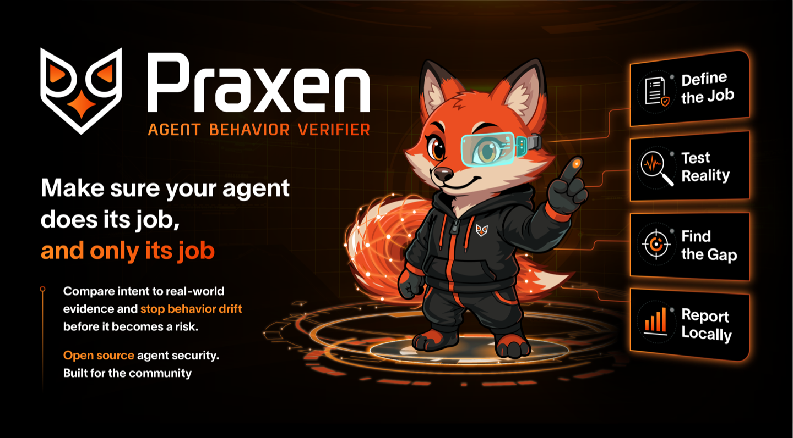

<!--
  Copyright 2026 Exabeam, Inc.
  SPDX-License-Identifier: Apache-2.0
-->

  

# Praxen
**agent behavior verifier**

> ### Make sure your agent does its job — and only its job.

That's where the risk actually lives: most agentic security and safety failures come down to an agent **not doing its job** — malfunctioning, misaligned, or adversarially subverted.

**Praxen** is named for **praxis** (Ancient Greek *πρᾶξις*), the act of turning theory into practice — which is exactly its job: verifying that an agent's *declared* intent (the theory) actually shows up in its *observed* behavior (the practice).

---

**📦 Install** — Praxen runs on **Claude Code** and **OpenAI Codex** (same skill, platform-specific packaging):
- **Claude Code:** one command — `claude plugin marketplace add open-agent-ai-security/praxen && claude plugin install praxen@open-agent-ai-security`
- **OpenAI Codex:** one command — `codex plugin marketplace add open-agent-ai-security/praxen && codex plugin add praxen@open-agent-ai-security`

Full guide (including the no-marketplace path — just point any other agent at the repo): [docs/installation.md](docs/installation.md).

**👀 See a real report** first — the [live FinBot analysis report](https://open-agent-ai-security.github.io/praxen/examples/finbot/finbot-analysis.html), rendered on GitHub Pages.

---

## Why behavior verification?

Praxen is the open-source reference implementation of **Agent Behavior Verification (ABV)** — a proactive control model for AI agents and digital workers. The premise is the same one identity and access management applies to human employees: every actor has an authorized role, and the controls have to actually enforce it.

And a misbehaving agent is hard to catch: whatever the cause, it surfaces the same way — as wrong behavior. So the only reliable signal is the *behavior* itself.

That's why screening for prompt injections, or scanning code for known-bad patterns, isn't enough. Those are necessary but partial: they catch some inputs and some implementation flaws, not the question that actually matters — *is this agent going to do, or is it doing, the thing it was deployed to do, and nothing else?*

Answering that requires two things Praxen makes first-class:

1. **A wholesale way to define the agent's job** — its mission, authorized tools, approved channels, counterparties, and forbidden actions. That's the **Worker Remit**.
2. **A way to test reality against that definition** — point Praxen at the agent's code, its live deployment state, or its behavioral history, and get back exactly where observed behavior diverges from declared intent.

Define the job. Test against the job. Everything else in Praxen serves those two steps.

---

## How it works (30 seconds)

- You write a **Worker Remit** — a markdown policy document declaring what the agent is allowed to do — by hand, or have Praxen draft one from your description or docs. ([authoring guide](docs/writing-remits.md))
- You point Praxen at **evidence** — source code, deployment state, behavioral logs, governance docs, or any mix. ([usage](docs/usage.md))
- Praxen reports the **gap**. Every finding answers a single question: *does observed behavior match declared intent?* ([reading reports](docs/interpreting-reports.md))

In practice, that's one sentence to your coding agent — e.g. *"Run a Praxen behavior analysis on `./my-agent`"* — and Praxen does the rest: it finds (or asks for) the Worker Remit, reads the workspace, and writes the report.

Findings land in a self-contained HTML report, a machine-readable JSON file, and a plain-text summary in `./reports/`. Nothing phones home.

Praxen runs **before deployment** and on each release — pre-deployment verification of the agent's controls against its remit. Runtime monitoring of the deployed agent (Agent Behavior Analytics, **ABA**) is a complementary layer outside Praxen's scope.

---

## What Praxen verifies

Every analysis runs a set of named verification patterns, including:

- **Policy-implementation divergence** — the code or behavior doesn't do what the policy document says
- **Credential exposure** — secrets in unexpected locations across the workspace
- **Configuration gaps** — auto-approved exec, disabled loop detection, missing rate limits
- **Capability drift** — new tools or outbound destinations not in the authorized baseline
- **Compound signal reasoning** — individual findings chained when they combine into a high-severity attack path

…and more — supply-chain risk (unpinned dependencies, unreviewed plugins), declared-but-never-consulted controls, empty security-stub files (planned-but-unbuilt sandboxes, approval gates, redactors), and secondary prompt discovery (session-loaded identity files like `SOUL.md` / `AGENTS.md` / `MEMORY.md` audited as system prompts). See [docs/usage.md](docs/usage.md) and [PRAXEN_SPEC.md](PRAXEN_SPEC.md) for the full set.

Each finding is tagged against the **OWASP Top 10 for LLM Applications 2025**, **OWASP Top 10 for Agentic AI Applications 2026**, OWASP's **A Practical Guide for Secure MCP Server Development 2026** (when MCP config is present), and the **RAISE Framework** (six-category 0–5 maturity score). Reports include per-framework **OWASP LLM Top 10** and **OWASP Agentic Top 10** coverage grids — browse the **[live OWASP Coverage Report](https://open-agent-ai-security.github.io/praxen/tests/baselines/owasp-coverage-report.html)** for the aggregate across Praxen's example suite. See [docs/owasp.md](docs/owasp.md) and [docs/RAISE.md](docs/RAISE.md) for the frameworks, and [docs/interpreting-reports.md](docs/interpreting-reports.md) for how they appear on a report.

---

## Working with Praxen

Praxen produces an **expert review that focuses human attention.** Each report is a model-assisted analysis of where an agent's behavior may diverge from its remit. Treat the findings and RAISE maturity score as judgments to act on — a senior reviewer's notes, not an automated pass/fail. Scores are calibrated per model tier and vary run to run ([details](docs/understanding-variability.md)), and you can [challenge and revise any finding](docs/challenging-findings.md).

Praxen works by **reading your agent's real workspace in place** — its actual code, config, and logs. It writes findings only to `./reports/` and never modifies the agent. It runs as a skill inside your coding agent, using that agent's own tools rather than a separate sandbox, so run Praxen where you already trust that agent to operate. The [security model and assumptions](SECURITY.md#security-model-and-assumptions) covers this in full.

---

## Get started

- [**Installation**](docs/installation.md) — Claude Code or OpenAI Codex (plugin marketplace), or any other agent (point it at the repo)
- [**Quickstart**](docs/quickstart.md) — your first end-to-end report in about 15 minutes: have Claude author a remit for the FinBot demo agent, scan it, and read the report
- [**Writing Worker Remits**](docs/writing-remits.md) — authoring the policy document
- [**Usage**](docs/usage.md) — running an analysis end-to-end
- [**Interpreting Reports**](docs/interpreting-reports.md) — reading the HTML / JSON / TXT outputs
- [**Challenging and Revising Findings**](docs/challenging-findings.md) — what to do when you disagree
- [**Full documentation index**](docs/index.md)

**Prerequisites:** a coding agent (tested against [Claude Code](https://docs.claude.com/en/docs/claude-code/overview) and [OpenAI Codex](https://developers.openai.com/codex/skills); any agent with tool-use and multi-step instruction-following works) and Python 3.9+ on the PATH for the report renderer. No `pip install` needed.

**Model tier matters.** Praxen runs on a **frontier model** — Anthropic Sonnet-class or higher on Claude Code, a comparable tier (validated on GPT-5-class) on OpenAI Codex. Smaller models don't reliably do the remit-to-implementation cross-referencing Praxen depends on. And because the RAISE maturity bands are calibrated per model tier, **compare scores only within a fixed model** — a score produced on one model tier is not directly comparable to one from another. See [Understanding Run-to-Run Variability](docs/understanding-variability.md).

---

## Examples

The [`examples/`](examples/) directory contains real analyses against three agents — two deliberately vulnerable training agents (from the OWASP Agentic AI CTF and the Damn Vulnerable AI Agent project) and one real-world open-source product (the Salesforce Help Agent Accelerator). Each example ships with the Worker Remit we wrote, the HTML report, and the JSON findings — see [`examples/README.md`](examples/README.md) for the walkthrough.

> **`examples/` holds completed reports, not scan targets.** These directories are showcase output — what Praxen *produces*, not what it *scans*. A scan always needs two separate inputs: a **Worker Remit** and a **separate agent source tree**. To reproduce an example, use its remit (or the matching one under [`tests/remits/`](tests/remits/)) and clone the upstream source linked in [`examples/README.md`](examples/README.md). See [Quickstart](docs/quickstart.md) for the full walkthrough.

---

## Repository

- [`docs/`](docs/) — full documentation
- [`examples/`](examples/) — sample analyses against real vulnerable agents
- [`tests/`](tests/) — pre-release regression suite (twelve targets, source repo only — not in the distribution zip)
- [`CHANGELOG.md`](CHANGELOG.md) · [`SECURITY.md`](SECURITY.md) · [`CODE_OF_CONDUCT.md`](CODE_OF_CONDUCT.md) · [`CONTRIBUTING.md`](CONTRIBUTING.md)
- [`PRAXEN_SPEC.md`](PRAXEN_SPEC.md) — full technical specification
- [`STABILITY.md`](STABILITY.md) — the 1.0 stability contract + semver/compatibility policy

---

## Project sponsor

Praxen is sponsored by [Exabeam](https://www.exabeam.com/). Exabeam contributed the initial code and continues to provide ongoing support and contributions to the project as part of its commitment to security in an increasingly agentic world.

---

## License

Praxen is licensed under the [Apache License, Version 2.0](LICENSE). Portions of the knowledge base (`skills/behavior-verifier/knowledge/`) are distilled from OWASP Gen AI Security Project publications and used under [CC BY-SA 4.0](https://creativecommons.org/licenses/by-sa/4.0/); see [NOTICE](NOTICE) for attribution. Contributions are welcome under the same license, with a DCO sign-off — see [CONTRIBUTING.md](CONTRIBUTING.md).
